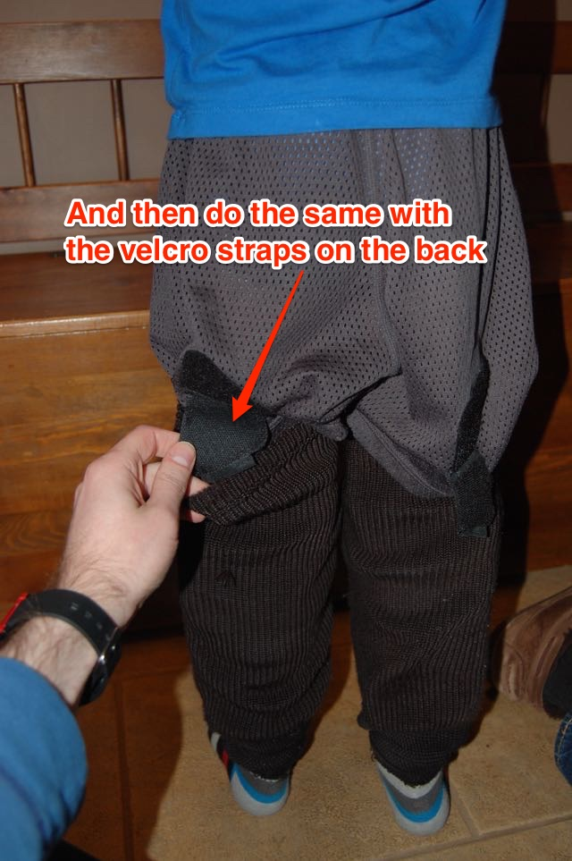
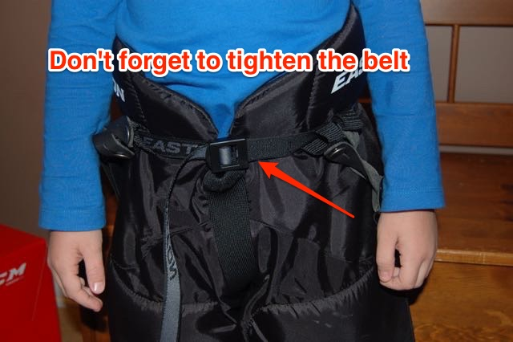
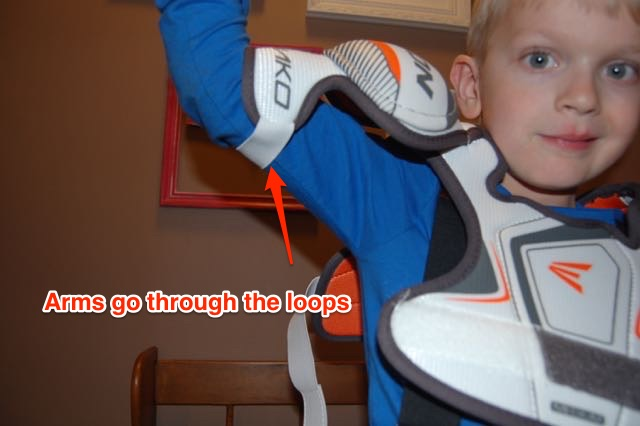
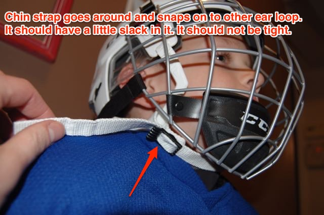

# Jock Shorts, Under Shirt and Socks

Short sleves are just fine.

# Shin Pads

# Hockey Socks

# Player Pants

# Suspenders

These are pretty self explanatory.

# Shoulder Pads

First, they go over the head.

# Elbow Pads

There are "Left" and "Right" labels on the inside of each elbow pad. You can just
help put them in place and Charlie puts on the straps so they are comfortable.

# Neck Guard

Just wrap it around and velcro it in the back.

# Jersey

# Skates

1. Ensure the top two eyelets of each skate are undone and that the next two eyelets are loose.

1. Slide the skate on making sure the heel is sitting snuggly in the heel of the skate boot.

1. Tighten the laces on the bottom part of the skate boot.

1. Make sure they are nice and tight, otherwise the foot will move around inside the skate, making balance difficult.

1. To check the tightness, press on the sides of the skate boot as shown. The sides should move very little or not at all.

1. Lace up the top two eyelets.

1. Tighten the laces.

1. Tighten the laces some more. The skate should be snug around his foot and ankle the whole way up. If it is too loose, he won't have enough ankle support.
NOTE: This guide used to tell you to loop the laces around the back of the skate. Don't do this as it allows the laces to get loosers as he skates.
 

1. Loop one lace end around the other like you do when you tie your shoes.

1. Do that a second time (this helps the laces to stay tied).

1. See the double looped-ness.

1. Pull the laces tight, placing them between the two top eyelets (which helps the laces stay tied).

1. Finish off tying the laces like you tie your shoes.

## Removing the Skates

- Be sure to undo the top two eyelets on each skate and then loosen the next two.
This will make them much easier to take off.
- Don't forget to put the soakers back on and put the skates in the vented skate
pocket on the front of the bag.

# Helmet

# Gloves

# Stick

# Soakers

Don't forget to take the soakers off the skate blades!

# Skate!

Go have fun and skate hard!

